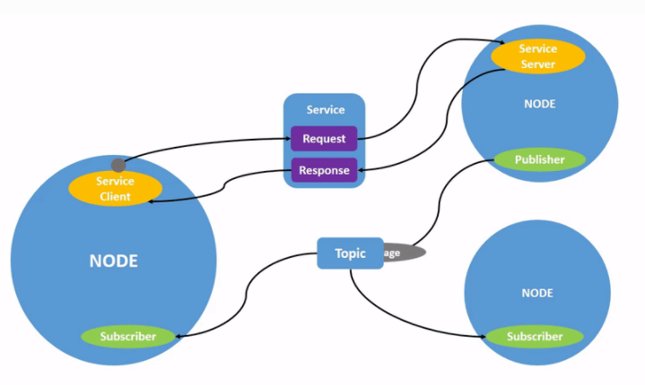

# What is ROS
ROS - Robotic Operating System is an open-source framework which is usefull for creating robotics software.
Such a "framework" allows us to create workspace for our robot and to seperate robot functionalities into 
ROS packages. Communication in ROS can be divided into 3 groups.
-topics
-services
-actions

First Header  | Second Header
------------- | -------------
Content Cell  | Content Cell
Content Cell  | Content Cell

