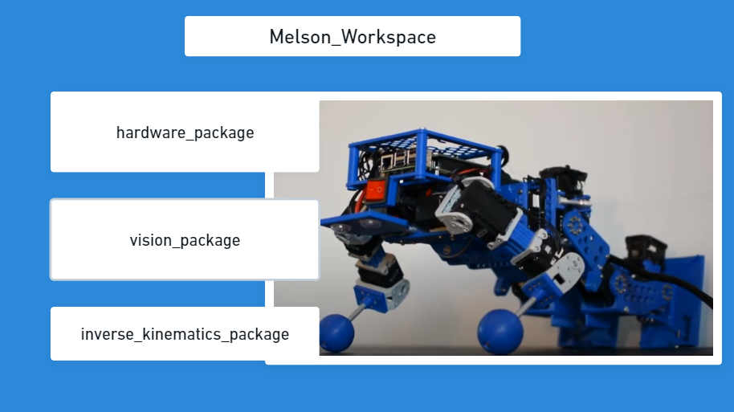

# Workspace and packages
ROS enables us to create Worspaces -> which are lets say projects a
- Worspaces -> which are let's say projects
- Packages -> which are part of a project.  
For clarity of the code I would recomment do divide each of robot functionalities into different packages.
As an example I will use humanioid robot. Our repo may be divided into:
- humanoid_bringup
- humanoid_footbal_core
- humanoid_hardware
- humanoid_inverse_kinematics
- humanoid_msgs
- humanoid_particle_filter
- humanoid_vision  
Each of these packages contains functionality of named directory.

  
Script create_workspace.sh creates us whole workspace with packages listed above. And also creates a link between
humanoid_msgs package and other packages. It was designed this way because same messages may be the same for all of the packages.

Creating workspace:
To create workspace we just need to create a new folder and cd directory to created folder. In created "workspace we need to create src forlder where all the packages will be included. If you've created a src folder then type catkin_make in console
This command will create new workspace for us. Nothing more needs to be done for creating workspace. 

Commands for creating workspace using linnux:
mkdir "name_of_folder"
cd "name_of_folder"
catkin_make

Creating packages:
For creating packages you need to specify the name of the package and ros_messages/ros_packages which will be included in this package.
As an example:

catkin_create_pkg humanoid_hardware std_msgs rospy roscpp

This code creates humanoid_packed with std_msgs, rospy, roscpp packages init. Rospy and roscpp packages are obligatory for writing code in ros. Std_msgs is additional package which include some ros messages.

If we want to create one package which contains all the messaches which can be used in each of creatd package we need to add setup.py file and run this script in cmake_file.
A bash script has been created in order to speed up action of creating whole workspace. The only thing which you have to change CMakeList.txt in msgs packgage as shown in this folder and add one line of code to all other packages.
catkin_create_pkg ${project_name}_bringup std_msgs rospy roscpp