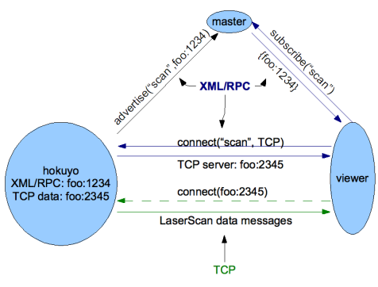
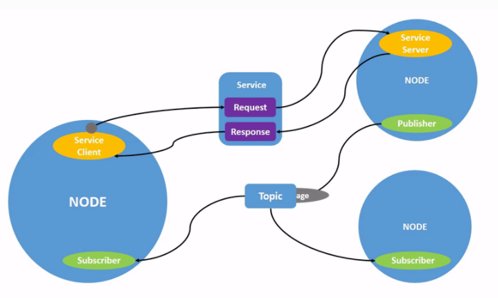

# ROS nodes and ways of executing code
Firstly I will talk about connecting everything as easy as it is possible. As it was shown before on image ros_quintessence     # tutaj odnośnik  
In ros we are creating nodes. You may see node as one script. Example: Let's say that we want to move our humanoid robot, as I am working with vision I will give it as an example

  Before creating any node or executing let's say python code which creates node you need to run roscore.
Rosmaster is implemented via XMLRPC, which is a stateless, HTTP-based protocol. The master has API which allows to register publishers 
subscribers and service providers. Parameter Server is part of ROS_Master and is also implemented via XMLRPC.
Node has several API's:
- slave API -> XMLRPC has two roles : receiving callbacks from master and negotiating connections with nodes
- topic transfer protocole -> uses TCPROS or UDPROS (TCP/IP socket connections)
- command line API -> enables configured at runtime

More: http://wiki.ros.org/ROS/Technical%20Overview