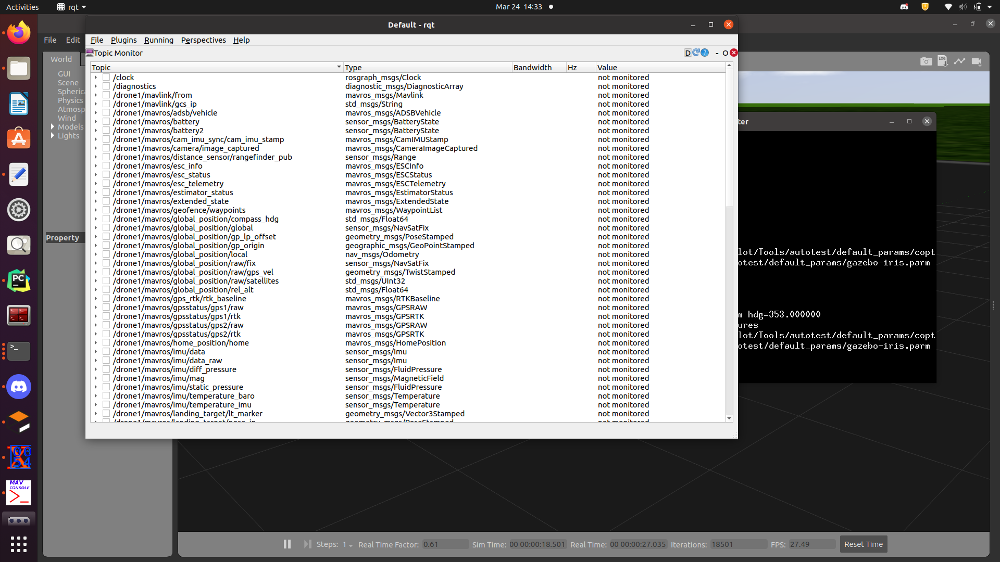
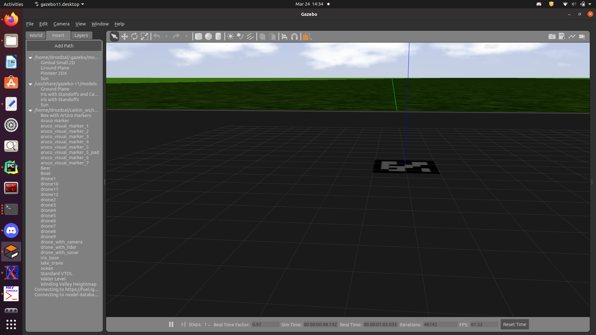
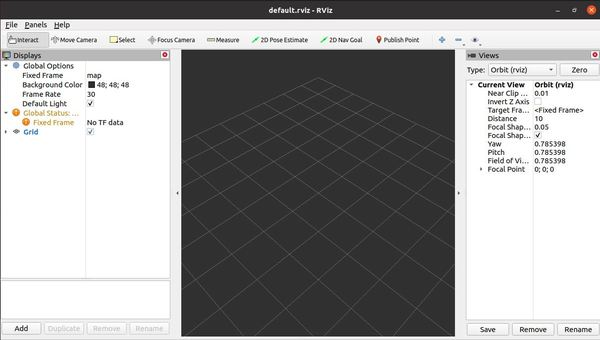

# ROS usefull tools
There is many usefull tools which can be used with ROS. Here you can see some of them which i find usefull.
Some of them enables us to check parameters of our robot during executing code. The other ones may be used
to design models of our robot and test code in simulation.

RQT
---
rqt enables to monitor whole system. This tool allows us to check how all nodes are connected. All node connection can be seen here. This tool also allows us to monitor whole proces during real time. We may see what is send on topic 
without printing the value ect. Here we can also call service, or send and goal to action. Each of these tasks can be done using command prompt 
However this visual tool is quite intuitive

Gazebo
---
This tool eneables us to create world and put design robot init. If we have 3D model in CAD programs like
NX, Inventor, Solidworks or just STL part models of our robots it is quite easy to put the robot 
in created world.

Rviz
---
